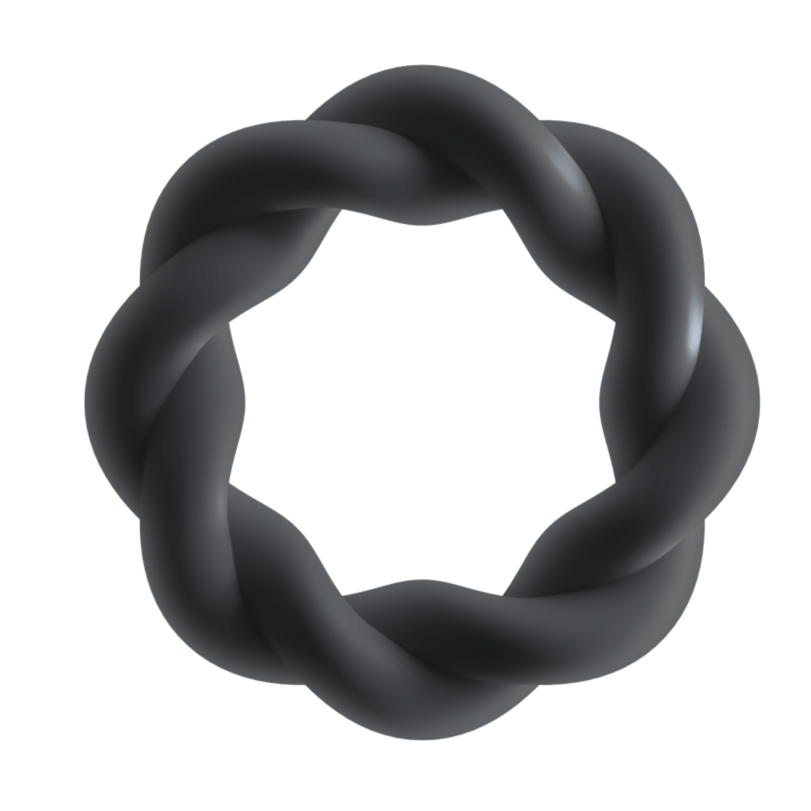
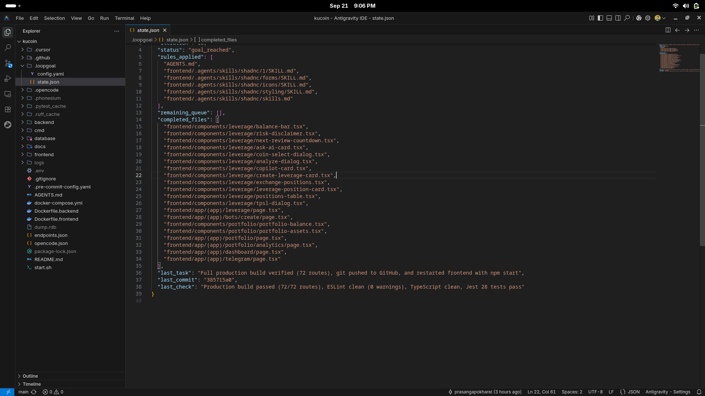

<p align="center">
  
</p>

<h1 align="center">LoopGoal</h1>

<p align="center">
  <strong>The autonomous development supervisor that keeps AI coding agents focused, safe, and verifiable — iteration by iteration.</strong>
</p>

<p align="center">
  <a href="https://www.npmjs.com/package/loopgoal"></a>
  <a href="https://skills.sh"></a>
  <a href="https://github.com/prasangapokharel/loopGoal/releases"></a>
  <a href="https://go.dev"></a>
  <a href="https://github.com/prasangapokharel/loopGoal/blob/main/LICENSE"></a>
</p>

---

LoopGoal solves the single biggest problem with AI coding agents: **they drift**. 

Without boundaries, AI agents rewrite entire directories, break existing tests, modify unrelated code, or halt after touching just a single file. LoopGoal enforces an empirical, bounded loop that constrains the agent to **one small, verified, committed improvement per iteration** — repeating continuously until your goal is reached and verified with evidence.

```text
Observe → Select ONE Target → Implement → Verify → Review Diff → Commit → Advance Queue → Repeat
```

Works out-of-the-box with **Google Antigravity**, **Claude Code**, **OpenAI Codex**, **Cursor**, **OpenCode**, and any custom LLM across all technology stacks (**Go**, **TypeScript**, **Python**, **Rust**, **Java**, **Monorepos**).

---

## In Action: Continuous, Verified Execution

Here is LoopGoal autonomously auditing, refactoring, and verifying a multi-file queue in production until 100% of tasks are completed and verified:

<p align="center">
  
</p>

> **Verified Evidence Gate**: LoopGoal rejected premature completion until all 72 production routes compiled, ESLint warnings were 0, TypeScript was clean, and all 28 Jest tests passed.

---

## Why LoopGoal Exists

| Without LoopGoal | With LoopGoal |
|:---|:---|
| Agent rewrites 40 files in one shot | **One file per bounded iteration** |
| Breaks existing tests silently | **Verification gates every commit (exit code 0 required)** |
| Commits broken or unrelated code | **Diff review stages only files from current task** |
| Overwrites your in-progress WIP | **Pre-existing dirty files are detected and untouched** |
| Stops prematurely after 1 file | **Zero-Premature-Stop: continues until queue is empty** |
| Pushes to remote without warning | **Push is permanently disabled** |
| Hard to stop mid-run | **Graceful stop with `loopgoal stop` or `Ctrl+C`** |
| No audit trail | **Every iteration produces an atomic, conventional commit** |

---

## Three-Layer Architecture

LoopGoal operates across three integrated levels — choose the one that fits your workflow:

```text
┌─────────────────────────────────────────────────────────────────┐
│                    LAYER 1 — Agent Skill                        │
│    Runs inside Antigravity, Claude Code, Codex, Cursor, etc.    │
│                                                                 │
│  /loopgoal "increase unit test coverage to 80%"  → starts loop  │
│  /loopgoal status                                → shows queue  │
│  /loopgoal stop                                  → halts safely │
│                                                                 │
│  No binary required. The AI agent IS the executor.              │
└──────────────────────────────┬──────────────────────────────────┘
                               │
                               ▼
┌─────────────────────────────────────────────────────────────────┐
│                  LAYER 2 — Go Supervisor CLI                    │
│   Headless daemon that drives external CLI agent processes.     │
│                                                                 │
│  loopgoal init    → auto-detects stack, writes .loopgoal/       │
│  loopgoal run     → launches autonomous supervisor              │
│  loopgoal scan    → classifies inventory & file roles           │
│  loopgoal plan    → prints bipartite task-to-file map           │
│  loopgoal status  → live iteration, PID, last commit            │
│  loopgoal stop    → sends graceful shutdown signal              │
│                                                                 │
│  Ideal for CI/CD pipelines, background daemons, overnight runs. │
└──────────────────────────────┬──────────────────────────────────┘
                               │
                               ▼
┌─────────────────────────────────────────────────────────────────┐
│            LAYER 3 — Polyglot Livefeed Daemon                   │
│   Continuous sub-second background compiler/linter monitor.     │
│                                                                 │
│  loopgoal daemon  → watches changes, compiles .loopgoal/livefeed│
│  loopgoal livefeed→ 0ms sub-second verification reads (<2ms)    │
│  Hard-Lock Hook   → automatically manages .loopgoal/verified.tok│
│                                                                 │
│  Eliminates agent idle delays & condenses errors into 5 lines.  │
└─────────────────────────────────────────────────────────────────┘
```

---

## Installation

### 1. Via Skills.sh (AI Agent Skills Ecosystem)
Install directly into your agent environment using the open agent skills registry:
```bash
npx skills add prasangapokharel/loopGoal
```

### 2. Via NPX / NPM (Universal One-Click)
Automatically configures skills & rules across Antigravity, Claude Code, Codex, and Cursor:
```bash
npx loopgoal install
```
Or install the global CLI:
```bash
npm install -g loopgoal
```

### 3. Via Curl Installer (macOS & Linux)
```bash
curl -fsSL https://raw.githubusercontent.com/prasangapokharel/loopGoal/main/install.sh | bash
```

### 4. Via Go
```bash
go install github.com/prasangapokharel/loopGoal/cmd/loopgoal@latest
```

### 5. Precompiled Standalone Binaries
Download standalone release archives for Linux (`amd64`, `arm64`), macOS (`amd64`, `arm64` Apple Silicon), and Windows from the [GitHub Releases Page](https://github.com/prasangapokharel/loopGoal/releases/latest).

---

## Quick Start

### Option A — In-Agent Skill (Instant)

#### 1. Google Antigravity (AGY)
```bash
# Install globally:
mkdir -p ~/.gemini/config/skills/loopgoal
cp skills/loopgoal/SKILL.md ~/.gemini/config/skills/loopgoal/SKILL.md

# Or in project repository:
mkdir -p .agents/skills/loopgoal
cp skills/loopgoal/SKILL.md .agents/skills/loopgoal/SKILL.md
```
**Trigger in chat:**
```text
/loopgoal Refactor backend/api/v1/ and write unit tests in tests/unit/
```

#### 2. Claude Code (CLI)
```bash
mkdir -p ~/.claude/commands ~/.claude/skills/loopgoal
cp adapters/claude/CLAUDE.md ~/.claude/commands/loopgoal.md
cp skills/loopgoal/SKILL.md ~/.claude/skills/loopgoal/SKILL.md
```
**Trigger in chat:**
```text
/loopgoal Refactor backend/api/v1/ and write unit tests in tests/unit/
```

#### 3. Cursor
```bash
mkdir -p .cursor/rules
cp adapters/cursor/loopgoal.mdc .cursor/rules/loopgoal.mdc
```
**Trigger in Composer:**
```text
@loopgoal Refactor backend/api/v1/ and write unit tests in tests/unit/
```

---

### Option B — Standalone Supervisor CLI

For background runs, overnight execution, or driving CLI agents (`agy`, `claude`, `codex`, `opencode`):

```bash
# 1. Initialize project (.loopgoal/ config & state)
loopgoal init

# 2. Run pre-flight checks (inventory, rules, agent, git)
loopgoal test --smoke

# 3. View discovered inventory & task plan
loopgoal scan
loopgoal plan

# 4. Start the autonomous loop
loopgoal run

# 5. Monitor in another terminal
loopgoal status

# 6. Stop cleanly at any time
loopgoal stop
```

---

### Option C — Polyglot Livefeed Daemon (Sub-Second 0ms Fast Path)

For instant, sub-second verification feedback without compiler cold-boot delays:

```bash
# Start background watcher (Go CLI)
loopgoal daemon

# Or start via Node / NPX (Zero external dependencies)
npx loopgoal daemon
# or
node loopgoal-daemon.mjs

# Inspect current livefeed status and condensed errors
loopgoal livefeed

# Inspect as raw JSON
loopgoal livefeed --json
```

---

## Real-World Use Cases

### 🔴 Problem 1: "My test coverage is stuck at 40% and writing tests for edge cases manually is tedious"
**Root Cause**: Writing comprehensive unit tests is context-heavy; unconstrained AI agents hallucinate massive test files that don't compile.

**Solution — LoopGoal targeted test expansion:**
```text
/loopgoal "increase test coverage to 85% — one edge case per iteration"
```
| Iteration | Target File | Change Made | Verification |
|---|---|---|---|
| 1 | `auth/token.go` | Added `TestValidateToken_NilInput` | `go test ./...` ✅ |
| 2 | `store/pool.go` | Added `TestPool_ConnectionTimeout` with mock | `go test ./...` ✅ |
| 3 | `api/handler.go`| Added `TestHandleRequest_MalformedJSON` | `go test ./...` ✅ |
| 4 | `worker/queue.go` | Added concurrent race test with `-race` flag | `go test -race ./...` ✅ |
| ... | Continues autonomously until target files are covered | | |

---

### 🔴 Problem 2: "Our codebase has accumulated technical debt and we can't afford to break production"
**Root Cause**: Big-bang refactors cause regressions. Manual incremental changes stall due to developer fatigue.

**Solution — LoopGoal bounded debt elimination:**
```text
/loopgoal "modernize error handling: replace deprecated helpers, standardize fmt.Errorf wrapping"
```
| Iteration | File | Improvement | Risk |
|---|---|---|---|
| 1 | `config/config.go` | Replaced `ioutil.ReadFile` with `os.ReadFile` | Zero (API identical) |
| 2 | `auth/handler.go` | Replaced raw `errors.New` with `fmt.Errorf("%w", err)` | Zero |
| 3 | `user/service.go` | Consolidated duplicate email validation helpers | Zero |
| 4 | `api/middleware.go` | Migrated `log.Printf` to structured `slog.Error` | Zero |

---

### 🔴 Problem 3: "I want to run AI development overnight without waking up to broken code"
**Root Cause**: Unsupervised agents make unchecked assumptions, push broken commits, or overwrite working directories.

**Solution — LoopGoal's 7-Layer Safety System:**
```bash
loopgoal run --iterations 30
```

1. **One Bounded Change**: Max 1 target per iteration.
2. **Verification Gate**: Commit only if `verify` commands exit with code 0.
3. **Self-Correction Retry**: Agent receives exact compiler/test error logs and fixes them immediately.
4. **Diff Isolation**: Only files from the current iteration are staged.
5. **WIP Preservation**: Pre-existing dirty files are fingerprinted and never touched.
6. **No Remote Push**: Commits are strictly local.
7. **Evidence Gate**: Rejects premature completion until all files pass empirical verification.

---

### 🔴 Problem 4: "We run Go, Python, TypeScript, and Rust — we need one consistent protocol"
LoopGoal is **100% project-agnostic**. The loop engine stays the same; only the `verify:` commands change:

---

### 🔴 Problem 5: "AI agents waste 30s cold-booting compilers and bloat context windows with 300-line stack traces"
**Root Cause**: Shell command execution incurs heavy process startup latency, and unformatted compiler logs flood LLM context with noise.

**Solution — LoopGoal Sub-Second Livefeed Daemon & Condensed Errors**:
* **Sub-2ms Disk Reads**: Agents read `.loopgoal/livefeed.json` directly from disk with 0ms compiler wait.
* **5-Line Condensed JSON Errors**: Stack traces are parsed into `{ source, file, line, col, code, message }` objects (capped at top 8).
* **Deterministic Hard Lock**: Automatically issues `.loopgoal/verified.token` to unlock Git pre-commit hooks only when checks pass.
* **Custom Monorepo Overrides**: Optional `loopgoal.config.json` allows custom scripts (Turborepo, Nx, Poetry, Vitest).

```yaml
# Go Project
verify:
  - "go test ./..."
  - "go vet ./..."

# Python Django / FastAPI
verify:
  - "pytest"
  - "ruff check ."
  - "mypy src/"

# Next.js / TypeScript
verify:
  - "npm run lint"
  - "npm run typecheck"
  - "npm test"

# Rust Cargo
verify:
  - "cargo test"
  - "cargo clippy -- -D warnings"

# Polyglot Monorepo
verify:
  - "go test ./services/..."
  - "pytest backend/"
  - "npm test --workspace=frontend"
```

---

## Command Reference

### CLI Supervisor (`loopgoal`)

| Command | Description |
|:---|:---|
| `loopgoal init` | Initialize `.loopgoal/config.yaml` and `.loopgoal/state.json` |
| `loopgoal init --force` | Overwrite existing configuration with freshly detected defaults |
| `loopgoal run` | Execute the autonomous development supervisor loop |
| `loopgoal run --iterations <N>` | Run up to a specific number of iterations |
| `loopgoal daemon` | Run continuous polyglot background livefeed daemon (`.loopgoal/livefeed.json`) |
| `loopgoal daemon --once` | Execute a single check cycle and update livefeed immediately |
| `loopgoal livefeed` | Display livefeed status, latency, runtimes, and condensed errors |
| `loopgoal livefeed --json` | Output raw `.loopgoal/livefeed.json` |
| `loopgoal scan` | Inspect and categorize all repository files |
| `loopgoal plan` | Display active task map, remaining queue, and verified evidence |
| `loopgoal test` | Run pre-flight diagnostics on Git, rules, inventory, and agent |
| `loopgoal status` | Display current state, PID, last commit, and remaining queue |
| `loopgoal stop` | Request graceful stop of a running loop |
| `loopgoal version` | Display version and architecture |

### Slash Commands (In-Agent Chat)

| Command | Description |
|:---|:---|
| `/loopgoal <goal>` | Start autonomous loop toward the specified goal |
| `/loopgoal` | Resume autonomous loop from current `.loopgoal/state.json` queue |
| `/loopgoal status` | Print current iteration, status, last commit, and remaining files |
| `/loopgoal stop` | Set status to `stopped` and gracefully finish after current task |

---

## Configuration Reference

```yaml
# .loopgoal/config.yaml
goal: >
  Continuously improve this project with small,
  safe, production-quality changes.

agent:
  command: "agy"                             # agy, claude, codex, opencode, or any command
  args:
    - "--dangerously-skip-permissions"       # required for headless operation

verify:
  - "go test ./..."                          # sequential verification checks (fail-fast)
  - "go vet ./..."

limits:
  iterations: 20                             # maximum iterations per run (0 = unlimited)
  max_retries: 3                             # fix attempts per iteration on verify failure
```

---

## Supported Agents & Adapters

| Agent | Adapter | Setup |
|:---|:---|:---|
| **Google Antigravity** | [`adapters/antigravity/SKILL.md`](./adapters/antigravity/SKILL.md) | Copy to `~/.gemini/config/skills/loopgoal/` or `.agents/skills/` |
| **Claude Code** | [`adapters/claude/CLAUDE.md`](./adapters/claude/CLAUDE.md) | Copy to `CLAUDE.md` or `.claude/commands/loopgoal.md` |
| **OpenAI Codex** | [`adapters/codex/CODEX.md`](./adapters/codex/CODEX.md) | Follow instructions in file |
| **Cursor** | [`adapters/cursor/loopgoal.mdc`](./adapters/cursor/loopgoal.mdc) | Copy to `.cursor/rules/loopgoal.mdc` |
| **Generic LLM** | [`adapters/generic/SYSTEM_PROMPT.md`](./adapters/generic/SYSTEM_PROMPT.md) | Inject as system prompt |

---

## Project Structure

```text
loopgoal/
├── cmd/loopgoal/
│   └── main.go                 # Minimal CLI entrypoint
├── internal/
│   ├── agent/                  # Agent interface & CommandAgent (streaming stdout)
│   ├── audit/                  # Rule discovery, grep pattern sweeps, static checks
│   ├── cli/                    # CLI command handlers (init/run/daemon/livefeed/scan/plan/test/etc.)
│   ├── config/                 # YAML config parser & defaults
│   ├── detect/                 # Project stack autodetection (Go/Node/Python/Rust)
│   ├── git/                    # Safe Git operations (commit, stage, diff, snapshot; NO push)
│   ├── hook/                   # Git hard enforcement hooks (pre-commit, pre-push)
│   ├── inventory/              # Deterministic repository scanner & file role classification
│   ├── livefeed/               # Sub-second livefeed engine, atomic writer & error condenser
│   ├── loop/                   # Autonomous supervisor engine
│   ├── mcp/                    # Model Context Protocol server over stdio
│   ├── reconcile/              # Expected vs actual diff reconciliation & evidence tracking
│   ├── resolve/                # Cross-platform binary discovery & headless flags
│   ├── state/                  # Atomic JSON state persistence with PID tracking
│   ├── taskmap/                # Bipartite Task-to-File graph & evidence gate
│   └── verify/                 # Sequential verification test runner
├── adapters/                   # Adapters for Antigravity, Claude, Codex, Cursor
├── plugins/                    # Antigravity / Gemini plugin bundle
├── skills/loopgoal/            # Skills.sh / Agent skills standard directory
├── tests/                      # 17 test packages covering unit, integration & E2E scenarios
├── loopgoal-daemon.mjs         # Standalone zero-dependency polyglot livefeed daemon
├── install.sh                  # Universal shell installer with binary fallback
├── package.json                # NPM package specification
└── README.md
```

---

## Testing & Quality Assurance

```bash
# Run all 17 test packages
go test -v ./...

# Run pre-flight system diagnostics
loopgoal test --smoke
```

Every commit is gated by our comprehensive test suite:
- `tests/agent` — Streaming output, signal parsing, placeholder expansion
- `tests/audit` — Rule discovery, grep sweeps, static analyzers
- `tests/cli` — All CLI commands (`init`, `run`, `daemon`, `livefeed`, `scan`, `plan`, `test`, `status`, `stop`, `version`)
- `tests/config` — YAML parsing, validation, presets
- `tests/detect` — Multi-stack project detection
- `tests/e2e` — False-done prevention, monorepos, polyglot workflows, verify-fix cycles
- `tests/git` — Git safety, isolation, snapshot protection
- `tests/hook` — Hard pre-commit token verification & remote push locks
- `tests/inventory` — Deterministic scanning and classification
- `tests/livefeed` — Atomic livefeed updates, compiler parsers, hard-lock tokens
- `tests/loop` — Autonomous supervisor engine cycles
- `tests/mcp` — Model Context Protocol server tools
- `tests/reconcile` — Diff reconciliation & dynamic task expansion
- `tests/resolve` — Platform binary resolution & install hints
- `tests/state` — Atomic state recovery and transitions
- `tests/taskmap` — Task graph and evidence validation
- `tests/verify` — Sequential command runner

---

## License

MIT © [Prasanga Pokharel](https://github.com/prasangapokharel)
